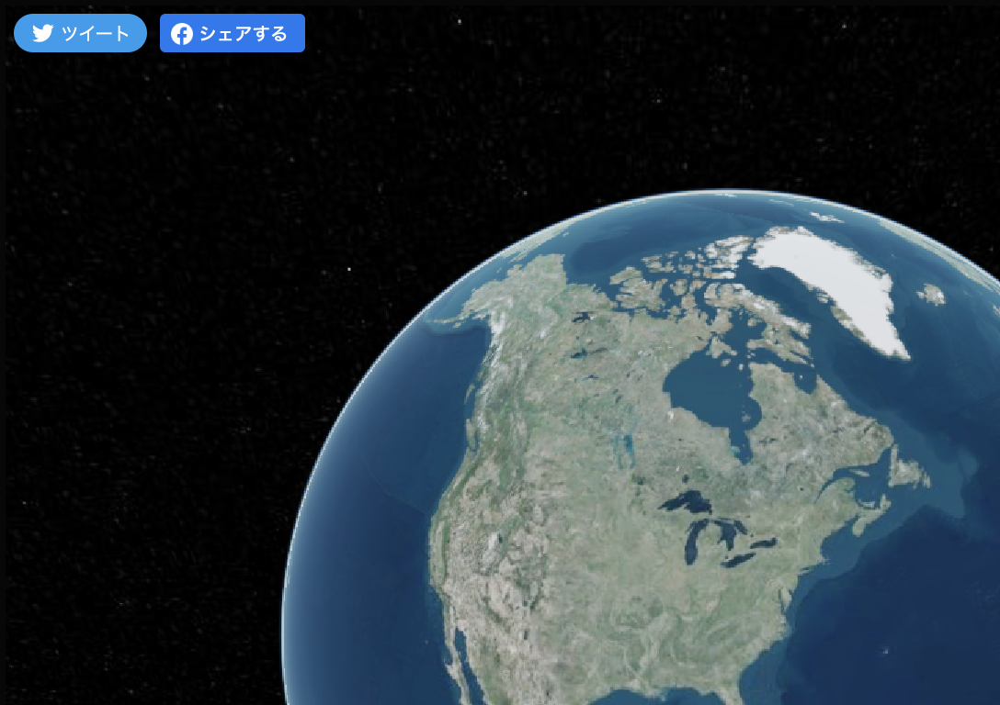
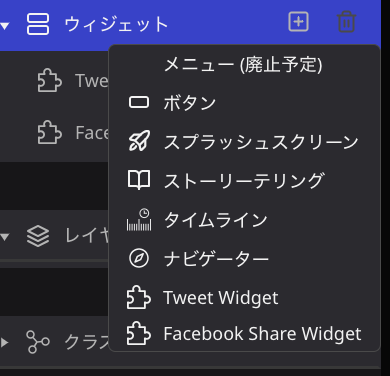
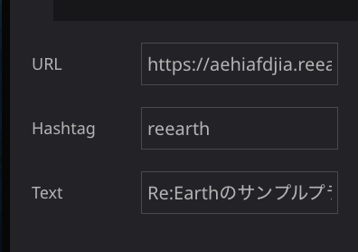
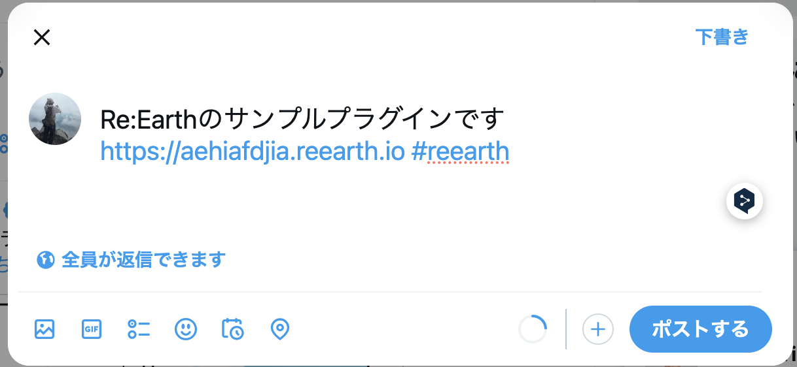

# Where is plugin
このプラグインでは、公開されているRe:EarthプロジェクトのページをFacebook、 X(旧Twittert)でシェアすることができるボタンを設置します。

## 設定方法
- プラグインをインストールしたら、ウィジェットから「Twitter widget」もしくは「Facebook share widgetlを追加します。

- Twitter widgetでは、以下の項目が設定可能です。
  - URL: 【必須項目】プロジェクトを公開した際のURLをこちらに指定してください。
  - Hashtag: 投稿に付与したいハッシュタグがあれば入力します。
  - Text: 投稿する際のデフォルトのテキストがあれば入力します。
  

- Facebook share widgetでは以下の項目が設定可能です。
  - URL: 【必須項目】プロジェクトを公開した際のURLをこちらに指定してください。

## 使い方
- それぞれのボタンを押下すると、閲覧してるプロジェクトをそれぞれのSNSに投稿するウィンドウが表示されます。

